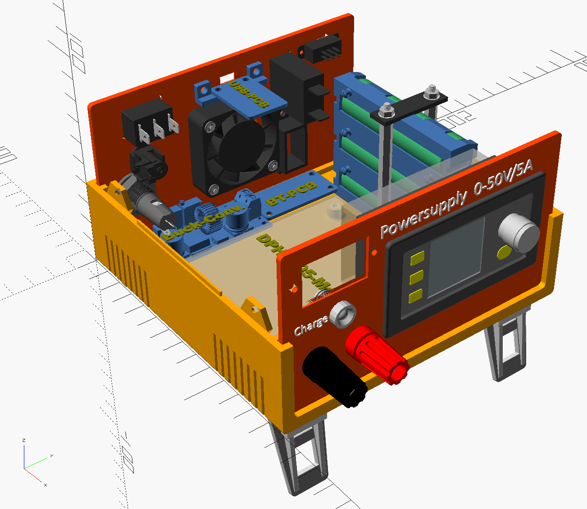

# Advanced Ultimate-Box-Maker

## Introduction
For my projects in electronics I often need an appropriate housing. 
Commercial products have the disadvantage that they don’t fit exactly and cause a lot of work for manual drilling, cutting, adapting, etc.
I needed a software solution for creating an individual box using a 3D-printer.
* The software must have mainly a parametric design so that the properties of the box can be easily changed.
* The software must have a GUI for changing the parameters so that the program code does not need to be changed.
* Ideally the software allows to save the parameters in individual files.
* The software with the less disadvantages I could find, was OpenSCAD.
It is relatively easy to learn and has a so called customizer for changing and saving the parameters. But it has also a lot of restrictions to deal with. Despite this OpenSCAD was the first choice. My normally used CAD-Software “Fusion-360” is nice to use but has only a bit of a customizer.

For that reason, the decision was using OpenSCAD and I searched around which programs exists to solve my problem.
I found the “Ultimate Box Maker” with its forks and put me on to extend the features of these programs with help of some excellent libraries.
The result is this “Advanced Ultimate Box Maker”.

## Sources used in this advanced version
Originally box designs, used libraries and license
•	`The original design was made by “Ultimate Box Maker” `from Heartman www.thingiverse.com/thing:1264391 and http://heartygfx.blogspot.com
•	`Great improvement to a PCB-based construction was made with the “Customizable revised Ultimate Box Maker”` from jbebel www.thingiverse.com/thing:2938921 and https://github.com/jbebel/Ultimate-Box-Maker.
•	`The integratin of a fan-guard was inspired by the “Customizable Fan Grill Cover”`  from mightynozzle www.thingiverse.com/thing:2802474
•	use of the Library “BOSL2” from https://github.com/revarbat/BOSL2/
•	use of the Library “NopSCADlib” from https://github.com/nophead/NopSCADlib/
•	`Programs are under license CC BY-NC 3.0 License and GNU General Public License 3`

## Requirements
1. OpenSCAD, download it from here: https://www.openscad.org/downloads.html
2. The library “BOSL2” from https://github.com/revarbat/BOSL2/
3. The library “NopSCADlib” from https://github.com/nophead/NopSCADlib
4. The actually “Advanced ultimate Box Maker” from here or thingiverse /avanced-ultimate-box-maker

## Installation
•	run the downloaded OpenSCAD-file and install the exe.
•	unpack the zip-file form BOSL2-library into the appropriate lib-directory (My Documents\OpenSCAD\libraries)
•	do the same with library-file “NopSCADlib”
•	The actually “Advanced ultimate Box Maker” from https://github.com/m-oster/avanced-ultimate-box-maker
Unpack the zip-file into the directory My Documents\OpenSCAD so that all files are in the sub-directory \Advanced-Ultimate-Box-Maker

for checking the installation, run the main-file “Advanced-Ultimate-Box-Maker-main.scad”, and press F5 within the GUI to create the box

## Directory structure
the directory structure is inspired by the one from NopSCADlib.
But the project creating features are not used here, because its too much effort in the moment to additionally extend and adapt the code.

| Path | Contents |
|:-----|:------|
| `assemblies` | additional parts which are used for the box |
| `docs` | Documentation files |
| `Examples` | Example projects with its own directories|
| `scad` | main scad file and associated scad files |
| `stls` | STL files for making printed parts |

## Features
Summary of Existing Features from the original version and the improved version:
•	Editable back- and front panel
•	Calculation of the box size from the PCB size and margin parameters
•	Horizontal or vertical text alignment arguments
•	Variable panel and tab thickness separate from the box
•	Square corners (no filet or chamfer)
•	Parameterize all dimensions, such that the box is infinitely scalable. Doubling every parameter will double the box in all dimensions.
•	Vents go through the floor and are scaled to fit the size of the filet.
•	For larger filets, scale interior filets to make exterior and interior filets concentric.
•	Decorations are optional
•	Box fixation tabs can individually be placed on the top or bottom shell

`Added more features to this Advanced version, list of the most important ones:`
•	Allows to integrate the electronic parts of the NopSCADlib
•	Choice of different case feet (Hole,integrated feet, Rubber feet, Foldable feet)
•	Choice of different threated inserts for fixation tabs
•	Choice of different kind of PCB-feet (inserts, pillars, spacers)
•	Holes with a recess for front- or backpanel
•	Longholes for front- or backpanel
•	Customizable fan-guard for the backpanel
•	a lot of fan-sizes are integrated and their correct screw-distance is autom. choosen.
•	Ledges on both upper edges of the box shells for better stabilization
•	Allows to create extra holes in the bottom shell
•	Choose predefined textfont for paneltext
•	Frequent remarks added in the code and a lot of debug outputs can be activted

With this advanced version the number of program lines has grown from round about 900 to over 1800 lines.

## Handling the program
After starting OpenSCAD, you see the customizer on the right side with the various program values categorized in sections.
Click the center symbol   to view the hole box

### Sections and values
Sections and values in the customizer on the right wondows side of the program:
These sections include several parametric values to adapt the box to the requirements in an easy way
and are generated from the appropriate code on the left of the editor window.

### Different kind of values in the customizer
| Value | Description |
|:---|:---|
|Arrays, expression begins with “a..”|Cannot be changed in customizer.MUST be changed in the editor window on the left because of the customizers restrictions.
|Textbox| sets a text f.e.Front- or Backpanel. Change in customizer|
|Boolean Value|activates/deactivates an option. Change in customizer|
|Select field|selects a value out of a given list|
|Numeric value|can be changed in customizer|
All values, with exception of the arrays, can be saved in a configuration-file on top of the customizer window. The arrays must be saved with the complete scad-file (i.e. changing of the code)
 
One member in an array is the minimum, otherwise the program throws an error.
If the part is not used, array-members can be deactivated when On/Off-value is set to “0”.

### The most important values:
#### Section “box options”
| Section | Description |Remark|
|:---|:---|:---|
|PCBDraw| draws the PCB inside the box, labels it with text of “TextOnPCB”|	Array must be edited in code window.|
|aAddHoles|For adding holes in the bottom shell| for additional PCBs f.e.|
|PartsDraw|Draws electr. Parts with help of the NopSCADlib.| Parts must be imported and positioned in Module “ShowElectrParts”|
|Bar recess|Small ledge on top of Shells, can be activated/deactivated. |When Thick <2.5mm, recess is autom. deactivated because it cannot be printed|
|sTextFonts|Selection of the font for text on panels.| List contains windows-fonts and can be changed in code window. Font names must fit to the name in windows.|

#### Section “case feet”
| Section | Description |Remark|
|:---|:---|:---|
|CaseFeet|Various feet can be chosen (simple hole, Rubber feet, Foldable feet in 2 sizes)| The last both are created as stl-files and can be 3D-printed.|

#### Section “Box Fixation Tabs”
| Section | Description |Remark|
|:---|:---|:---|
|tab_inserts|Various kinds of fixations| simple holes for screws, threaded inserts|

#### Section “PCB Options”
With defining these variables the dimensions of the box are autom. calculated.
The value “TopMargin” defines in result the hight of the box.
The console window shows the result of the dimensions of the box.

#### Section “PCB Feet”
| Section | Description |Remark|
|:---|:---|:---|
|PCBFeet|Various kinds of PCB-feet, from simple holes for screws to holes with threaded inserts| All dimensions are autom. adapted|
Coordinates of the 4 PCB-feet:	The console window shows the resulting distances of the PCB-feet to prove the correct values of the PCB-holes.
If you enable “ShowExplanations” in the section ”Special Values”, the console window shows the position of the 4 PCB-feet.

#### Section “Frontplate Holes”
The variables within this section define 3 kind of holes. 
All these hole-parameters are Arrays and must be changed in the code window, not in the customizer.
| Section | Description |Remark|
|:---|:---|:---|
|aFP_Holes|	Defines round holes or longholes|There are 2 diams, diam1 and diam2. If both are equal, the result is a round hole. If diam1 > diam2 the result is a longhole,If sym=0, the hole is narrower on the right side.If sym=1, the hole is narrow on left ans right side|
|aFP_Sholes|Defines square holes
|aFP_SHolesRecess|    	Defines a recess of (PanelThick - Recess)|If Recess is positiv, its on the outer side. If recess is negativ, its on the inner side.

#### Section “Frontplate Text”
There are 2 kind of Texts. Normal text and round text.
All these hole-parameters are Arrays and must be changed in the code window, not in the customizer.
| Section | Description |Remark|
|:---|:---|:---|
|aFP_RTexts|	Defines round round text.| Useful for labeling Poti-values|
|aFP_STexts|	Defines normal text|

#### Section “Backplate Holes”, same as for Frontplate Holes

#### Section “Backplate Text”, same as for Frontplate Text

#### Section “Fan-guard settings”, only for the Backplate
| Section | Description |Remark|
|:---|:---|:---|
|BP_fan_position|	Pos. of the fan-guard|can be activated by On/off-value set to “1”|
|Fan_size_in_mm|	List of fans are integrated in an array| When selecting a size, all parameters are calculated autom.|
|Screw_hole_diameter|	Diameter of the Fan-screw| M2, M3 or M4
|Fan_min_border_size|	The best fitting values are predefined.| Change them carefully|
|Fan_line_size| Size of pattern lines
|Fan_line_space| Space between two lines of the inner pattern	
|Number_of_support_lines|	Number of crosshairs for the fan-guard| 4 is a good value

#### Section “STL-element to export”
These Boolean values determine which part should be printed. `It makes sense to enable only one part.`
With keys F5, then F6, you can render a part for STL-Export.
Export the part with key F7 and save it as STL-file.
| Section | Description |Remark|
|:---|:---|:---|
|TShell|	Top shell of the box|
|BShell|	Bottom shell of the box|
|FPanl|	 Frontpanel|
|BPanel| Backpanel|
|SmallParts|Small assembly-parts which should be printed|It depends what you have choosen, f.e. can be spacers for the PCB.

#### Section “Special values”
| Section | Description |Remark|
|:---|:---|:---|
|ShowExplanations|	Self defined echo-outputs in the console-window|They are defined in the “MyExplanations.scad” file. f.e.the position of the 4 PCB-feet
|Debug|	When “1”, there is a lot of echo output from program-values|For easier assignment, the output has prefixed.<mod.>: from which module the output comes.<decription>: name of the variable or its description

